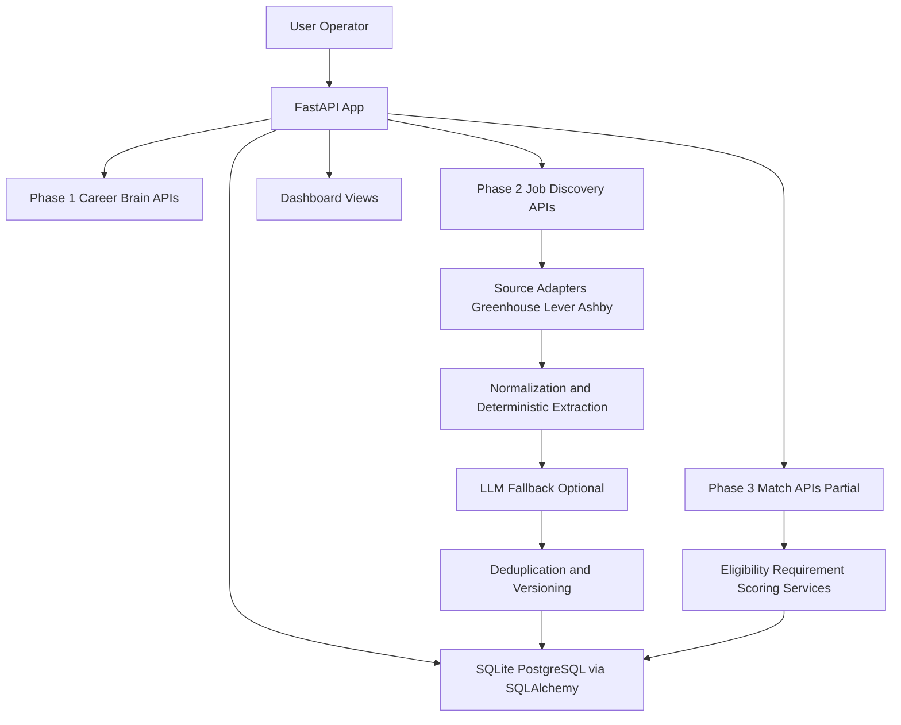

# RangeApply

AI-assisted career platform focused on job discovery, job intelligence, and stepwise automation toward autonomous applications.

## 1) Project Overview

RangeApply (CareerOS) is built to reduce repetitive job-search work by combining:
- structured career context,
- automated job discovery/normalization,
- and an emerging match-intelligence layer.

The technically interesting part is the phased architecture: foundational truth-validated career data (Phase 1), production-style ingestion and deduplication (Phase 2), then match orchestration scaffolding (Phase 3 in progress).

## 2) Current Development Status

| Phase | Status | Summary |
|---|---|---|
| Phase 1 — Foundation | ✅ Completed | Career Brain models, service layer, truth validation, v1 API |
| Phase 2 — Core Career/Job Intelligence | ✅ Completed | Multi-source job discovery, normalization, deduplication, persistence, v2 API + dashboard |
| Phase 3 — Autonomous Application System | 🟡 In Progress | Match-engine domain/services + DB schema exist; end-to-end automation not complete |

**Current overall status:** Core discovery pipeline is working end-to-end; full autonomous application execution is not implemented yet.

### What currently works end-to-end
- Source discovery (Greenhouse/Lever/Ashby) → normalization/extraction → deduplication/versioning → database persistence
- Read/query flows via `/api/v2/*`
- Internal dashboard views for discovery runs and job inspection

### What remains incomplete
- True autonomous application submission pipeline
- Browser-based application execution workers
- Fully wired v3 intelligence API (current routes are stubs)

## 3) Phase 1 — Foundation (Completed)

- **Core backend architecture:** FastAPI application with modular route structure (`app/api/routes`).
- **Typed domain modeling:** Pydantic models for profile, skills, projects, experience, achievements, preferences, facts/claims.
- **Truth layer:** `TruthValidator` enforces verification rules before facts are considered application-safe.
- **Career service layer:** `CareerBrainService` loads structured seed data and provides programmatic access/search/relevance helpers.
- **Configuration handling:** `pydantic-settings` based config with `.env` support (`app/config.py`).
- **Testing base:** Unit/API tests for models, validators, service, and v1 endpoints.

Why it matters: this phase establishes reliable, typed, auditable input data for later automation phases.

## 4) Phase 2 — Core Career/Job Intelligence (Completed)

- **Job source adapters:** Greenhouse, Lever, Ashby public API adapters (`app/jobs/sources`).
- **Ingestion pipeline orchestration:** `JobDiscoveryService` coordinates discover → normalize → enrich → deduplicate → persist.
- **Extraction + normalization:** deterministic parsing for job signals; canonical keys and content hashes.
- **Deduplication + provenance:** multi-level identity resolution, cross-source tracking, and job version history.
- **Persistence + schema evolution:** SQLAlchemy ORM + Alembic migrations for jobs/discovery tables.
- **Operational surfaces:** `/api/v2` endpoints and server-rendered dashboard (`/dashboard/*`).
- **Optional enrichment components:** Firecrawl fetcher and LLM fallback provider abstractions are implemented.

Engineering approach: deterministic-first ingestion with explicit provenance and versioning to keep data quality high.

## 5) Phase 3 — Autonomous Application System (In Progress)

### Implemented so far
- **Intelligence domain models/services:** eligibility, requirement interpretation, evidence resolution, scoring, explanation generation, orchestrator (`app/intelligence/services`).
- **Phase 3 database schema:** match policies/runs/job matches/requirement assessments migration (`b11ea16cb71f`).
- **Initial API surface:** `/api/v3/matches` routes are present.
- **Golden-case tests:** intelligence service behavior tested with mocked career context (`tests/intelligence/test_golden_cases.py`).

### Not yet implemented end-to-end
- Autonomous job application execution workflow
- Real browser automation pipeline for submission
- Persisted match recomputation pipeline wired into v3 API (current routes return stub responses)
- Full application state machine/retry orchestration for submission lifecycle

## 6) Architecture



## 7) Technology Stack

| Category | Technologies (observed in repo) |
|---|---|
| Backend | Python, FastAPI, Pydantic, pydantic-settings |
| Database | SQLAlchemy, SQLite/PostgreSQL support, Alembic |
| Job Intelligence | Deterministic extraction/normalization, deduplication/versioning |
| AI/LLM | Gemini provider abstraction + stub fallback |
| Web scraping/fetching | httpx, Firecrawl fetcher abstraction |
| Frontend/UI | Jinja2 server-rendered dashboard templates |
| Testing | pytest, pytest-asyncio, FastAPI TestClient, httpx MockTransport |
| Tooling | Ruff, editable package via `pyproject.toml` |

## 8) Current Capabilities

| Capability | Status | Notes |
|---|---|---|
| Career Brain data models and API | ✅ Completed | v1 routes and service layer implemented |
| Job discovery from ATS sources | ✅ Completed | Greenhouse/Lever/Ashby adapters + tests |
| Job normalization and extraction | ✅ Completed | Deterministic extraction + canonicalization |
| Deduplication and provenance tracking | ✅ Completed | Multi-level matching + version snapshots |
| Discovery observability dashboard | ✅ Completed | `/dashboard/`, `/dashboard/jobs`, `/dashboard/runs` |
| Match engine core services | 🟡 In Progress | Services and tests exist; not fully wired to runtime pipeline |
| v3 match API with persisted outputs | 🟡 In Progress | Routes exist but currently stubbed |
| Autonomous application submission | 🔴 Planned | No end-to-end submission executor in repo |
| Browser automation for applications | 🔴 Planned | No Playwright worker pipeline implemented |

## 9) Development Journey

1. **Phase 1:** built a typed, truth-validated career data foundation and stable API surface.  
2. **Phase 2:** introduced production-style ingestion complexity: source adapters, extraction, normalization, deduplication, persistence, and operational dashboarding.  
3. **Phase 3 (current):** started intelligence orchestration (eligibility/fit/explanations) and schema support, but full autonomous application execution is still ahead.

## 10) Future Roadmap

### Near Term
- Wire v3 APIs to real match orchestration and persistence
- Trigger/scaffold match recalculation from discovery events
- Tighten dashboard intelligence views using actual match records

### Medium Term
- Add robust job/application state transitions with retry/recovery
- Expand source integrations and scheduling controls
- Improve observability around run failures and scoring drift

### Long Term
- Production-grade autonomous application execution workers
- Human-in-the-loop controls for approval/override
- Deployment hardening, security, and scale-focused operations

## 11) Running the Project

### Prerequisites
- Python 3.9+
- pip

### Setup
```bash
cd /home/runner/work/Range-Apply/Range-Apply
python -m venv .venv
source .venv/bin/activate  # Linux/macOS
# .venv\Scripts\activate   # Windows

pip install -e ".[dev]"
cp .env.example .env       # use `copy` on Windows
```

### Environment
Use `.env.example` as the template. Key variables include:
- `DATABASE_URL`
- `CAREER_DATA_PATH`
- `LLM_PROVIDER` (`stub` or `gemini`)
- `FIRECRAWL_API_KEY` (optional)
- `GEMINI_API_KEY` (required only when `LLM_PROVIDER=gemini`)

### Database
The app initializes tables on startup (`init_db()` in `app/database.py`).

If you use Alembic migrations:
```bash
alembic upgrade head
```

### Start backend
```bash
uvicorn app.main:app --reload --host 0.0.0.0 --port 8000
```

- API docs: `http://localhost:8000/docs`
- Dashboard: `http://localhost:8000/dashboard/`

### Run tests
```bash
pytest
```

### Lint
```bash
ruff check app tests
```

## 12) Project Structure

```text
Range-Apply/
├── app/
│   ├── api/                  # Phase 1 API routes
│   ├── jobs/                 # Phase 2 discovery, extraction, dedup, dashboard
│   ├── intelligence/         # Phase 3 matching models/services (in progress)
│   ├── services/             # CareerBrainService, TruthValidator
│   ├── config.py
│   ├── database.py
│   └── main.py
├── alembic/
│   └── versions/             # DB schema migrations (Phase 2 + Phase 3 tables)
├── docs/
│   ├── jobs/
│   ├── ARCHITECTURE.md
│   ├── DEVELOPMENT.md
│   └── PROJECT_STATE.md
├── tests/
│   └── intelligence/
├── pyproject.toml
└── .env.example
```

## 13) Engineering Highlights

- Clear phase-based modular architecture
- Deterministic-first ingestion and scoring strategy
- Strong separation of domain models vs persistence models
- Explicit migration strategy with Alembic revisions
- Cross-source provenance + version tracking for jobs
- Early match-orchestration scaffolding with testable service boundaries

## 14) Disclaimer / Project Status

This repository is actively developed.  
Phase 1 and Phase 2 are implemented; Phase 3 is partially implemented and not yet a full autonomous application system.

For evaluators: treat autonomous submission and full orchestration as roadmap/in-progress work, not completed functionality.
